# World Explorer Insights

A premium world intelligence dashboard built with Flutter – vintage atlas design, real-time country analytics, and explorer workspace.

## Features

- **Explorer Dashboard** – total countries, largest/populated/smallest nations, regional breakdowns
- **World Rankings** – top countries by population, area, density (click any to explore)
- **Regional Insights** – stats for Africa, Asia, Europe, Americas, Oceania
- **Country Intelligence** – population, area, density, ranks, comparisons, languages, currencies, borders
- **Explorer Board** – pin countries, add research notes, edit or remove pins
- **Search & Filter** – search by name/capital, filter by region, sort by population/area/name
- **Pull to Refresh** – random spotlight country on every refresh

## Tech Stack

- Flutter (Dart) – UI framework
- BLoC – state management
- Dio – API requests
- Shared Preferences – local storage
- REST Countries API – real country data

## Getting Started

```bash
# Clone the repository
git clone https://github.com/anatoliugr-4369-16-bot/world_explorer_insights.git

# Navigate to project
cd world_explorer_insights

# Get dependencies
flutter pub get

# Run the app
flutter run


```

## Screenshots

### Dashboard

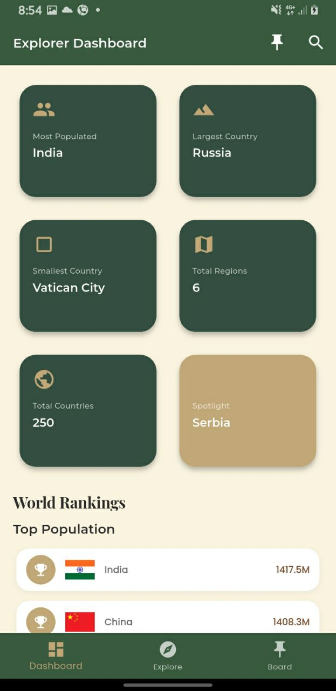
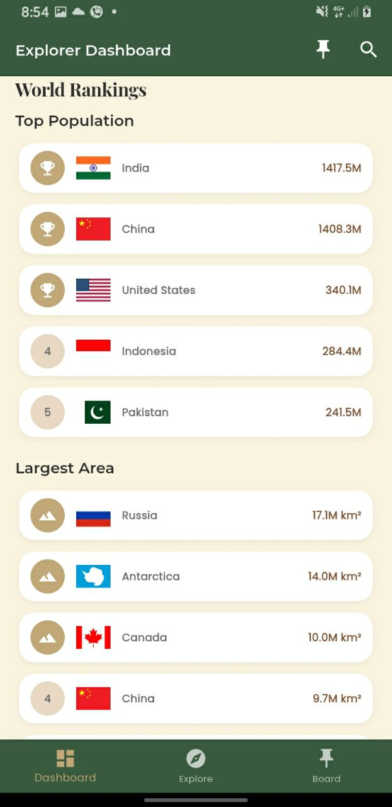
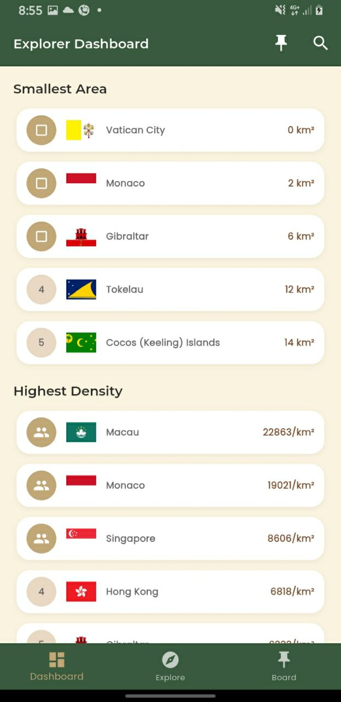
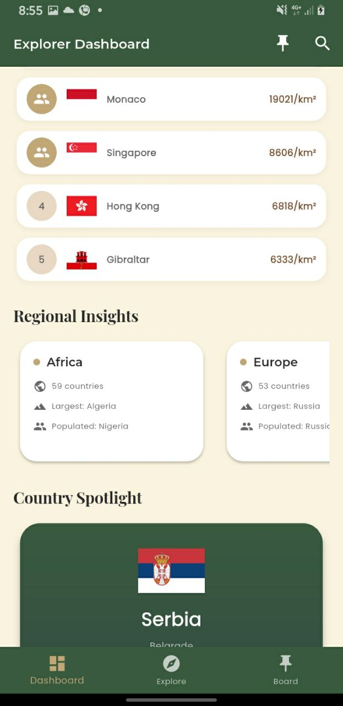
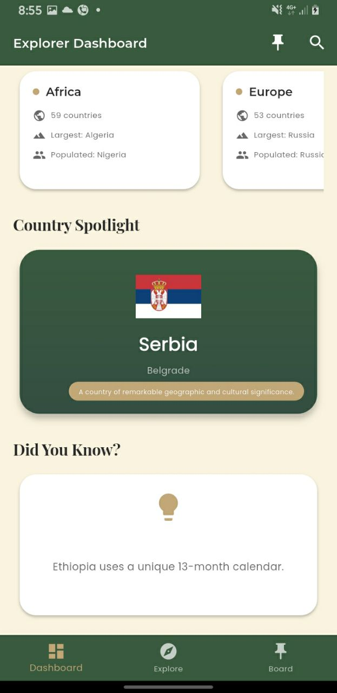
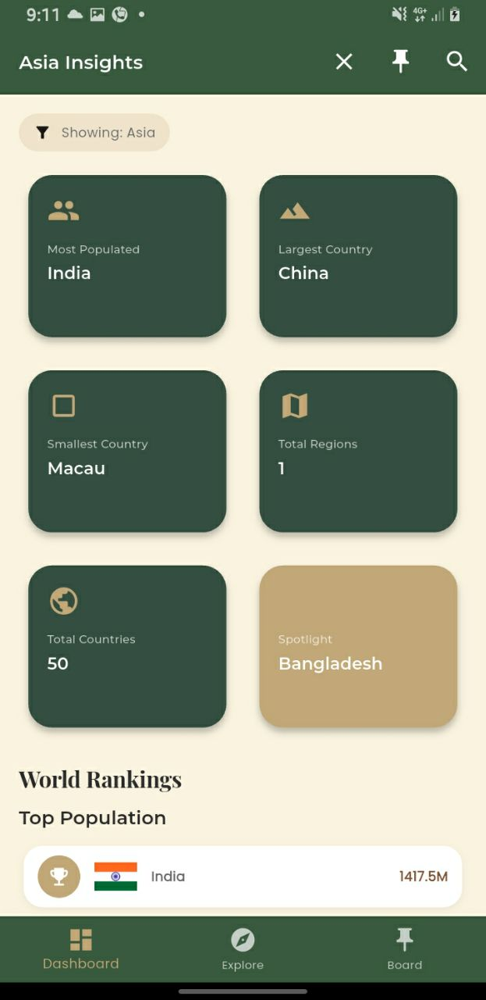

### explore screen

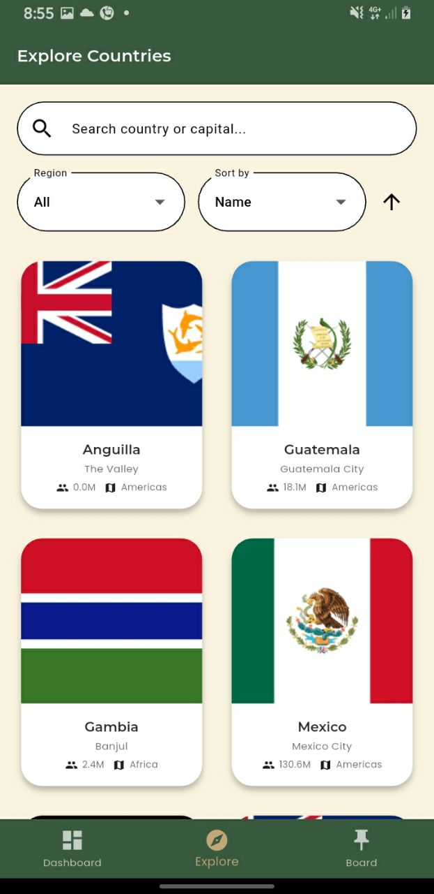
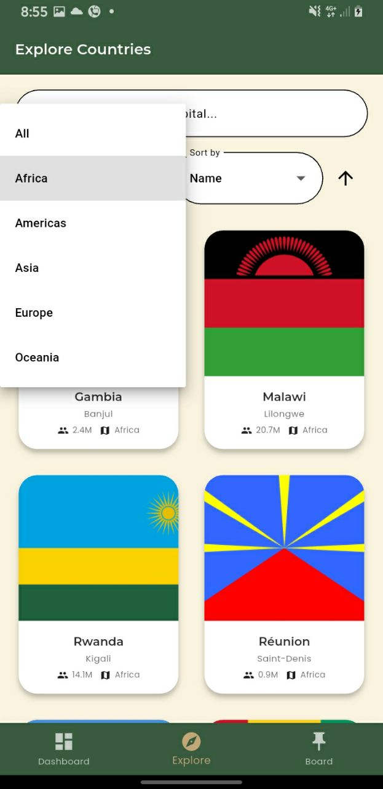

### Explorer_board

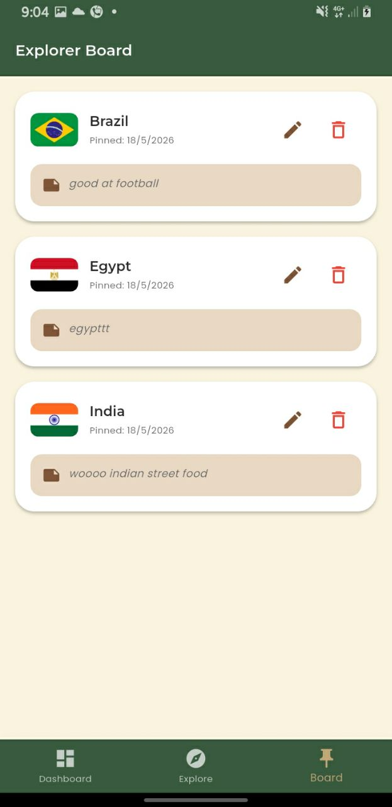
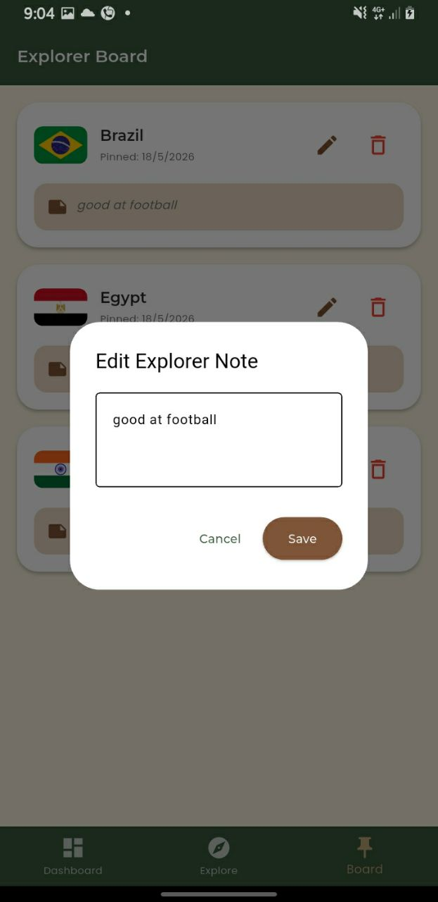

### detailed_screen

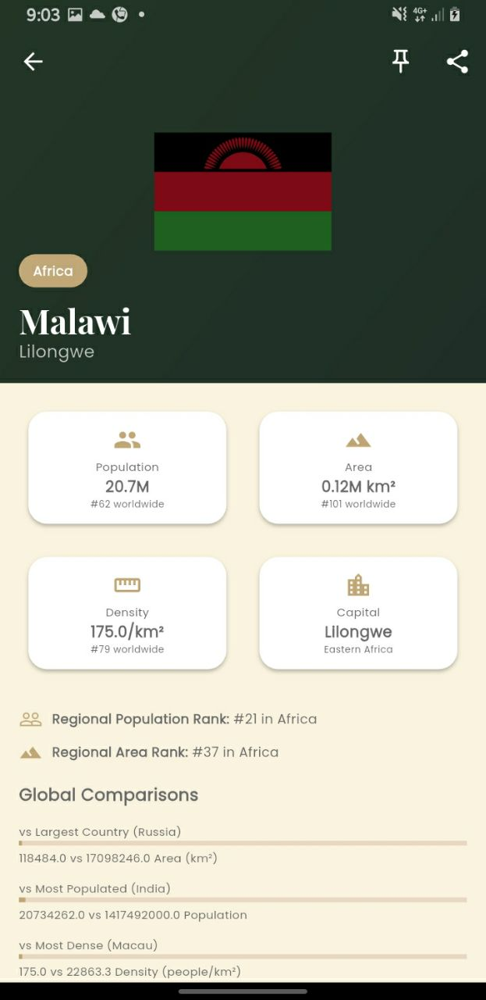
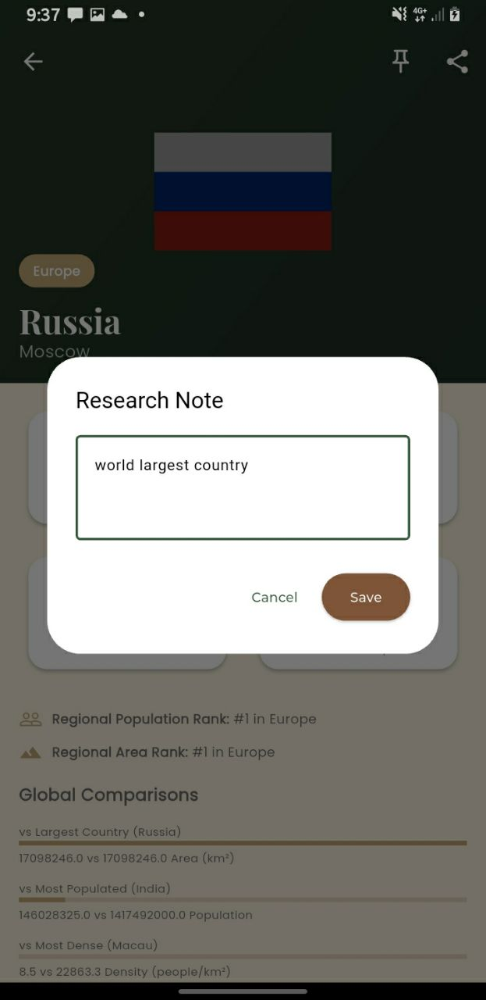

### Author

Anatoli chala UGR/4369/16
